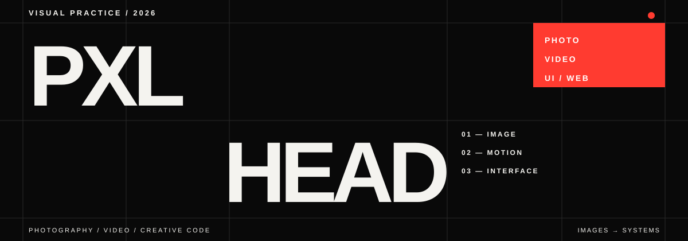

<p align="center">
  
</p>

<p align="center">
  <a href="https://pxl-head.github.io/pxl-head-portfolio/"><b>PORTFOLIO</b></a>
  &nbsp;&nbsp;·&nbsp;&nbsp;
  <a href="https://t.me/pxl_head"><b>TELEGRAM</b></a>
  &nbsp;&nbsp;·&nbsp;&nbsp;
  <a href="https://github.com/pxl-head?tab=repositories"><b>PROJECTS</b></a>
</p>

> Images first. Code gives them rhythm, sequence and space.

## 00 — PROFILE

Photographer and videographer working between fashion, portraiture and visual storytelling. I build image-first websites with a strong sense of typography, composition and motion — using code as one more creative tool.

## 01 — BACKGROUND

<table>
  <tr>
    <td width="33%" valign="top">
      <b>PROGRAMMING</b><br><br>
      <code>COMPLETED</code><br><br>
      Completed several programming courses focused on HTML, CSS, JavaScript and practical web development.
    </td>
    <td width="33%" valign="top">
      <b>DESIGN</b><br><br>
      <code>NOW</code><br><br>
      Currently studying design: typography, composition, visual identity and digital interfaces.
    </td>
    <td width="33%" valign="top">
      <b>DIRECTION</b><br><br>
      <code>NEXT</code><br><br>
      Developing a personal practice where photography, motion, art direction and creative coding meet.
    </td>
  </tr>
</table>

## 02 — SELECTED WORK

| Project | Format | What makes it different |
| :--- | :--- | :--- |
| **[pxl_head](https://github.com/pxl-head/pxl-head-portfolio)** · [live ↗](https://pxl-head.github.io/pxl-head-portfolio/) | Personal portfolio | A custom interface built around three visual modes — **Photo, Video and Sites** — with unconventional navigation and an image-led UI. |
| **[Vika Piratova](https://github.com/pxl-head/vika_piratova)** · [live ↗](https://pxl-head.github.io/vika_piratova/) | Artist portfolio | A multi-page editorial portfolio with cases, galleries and a continuous **Visual feed** for photography and art projects. |
| **[MONTAN.ME](https://github.com/pxl-head/montan-me-portfolio)** · [live ↗](https://pxl-head.github.io/montan-me-portfolio/) | One-page portfolio | An immersive bilingual one-page experience where projects unfold as a single visual sequence. |

## 03 — PRACTICE

```text
IMAGE       fashion / portrait / editorial
MOTION      moving portraits / lookbooks / backstage
INTERFACE   portfolio systems / image-first UI / experimental navigation
```

## 04 — TOOLKIT

`HTML` `CSS` `JavaScript` `TypeScript` `React` `Vite` `GitHub Pages` `Codex`

I care less about stacking technologies and more about finding the right visual system for each person, story and body of work.

## 05 — CURRENT FOCUS

Design studies · creative coding · stronger art direction · digital spaces for people whose work deserves more than a template.

<p align="center">
  <sub>IMAGES / CODE / CURIOSITY</sub>
</p>
