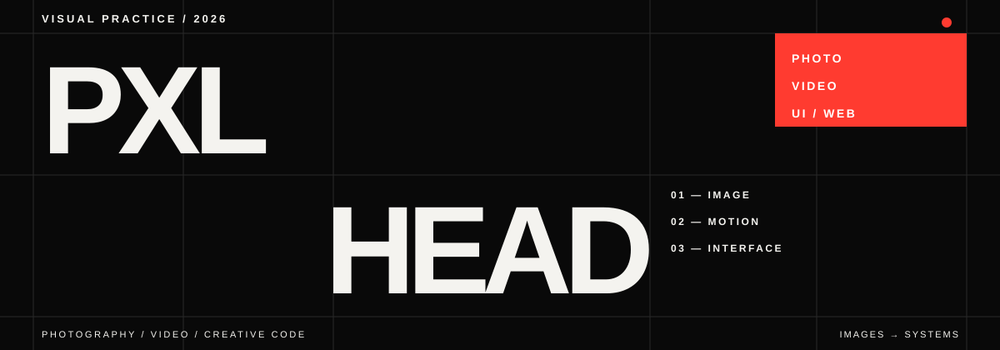

  

  <a href="https://pxl-head.github.io/pxl-head-portfolio/"><b>Portfolio</b></a>
  &nbsp;&nbsp;·&nbsp;&nbsp;
  <a href="https://t.me/pxl_head"><b>Telegram</b></a>
  &nbsp;&nbsp;·&nbsp;&nbsp;
  <a href="https://github.com/pxl-head?tab=repositories"><b>Repositories</b></a>

I'm a photographer and videographer working in fashion, portraiture and editorial imagery. I also design and build the websites that present my work.

## About

My practice spans photography, short-form video and web design. I pay close attention to how images are framed, sequenced and given room on screen.

Photography came first. Learning to code gave me control over how the work is presented, without relying on a ready-made portfolio theme.

## Learning

I have completed several programming courses in HTML, CSS, JavaScript and practical web development. I'm now studying design, with a focus on typography, composition, visual identity and interface design.

## Selected projects

| Project | Format | What I built |
| :--- | :--- | :--- |
| **[pxl_head](https://github.com/pxl-head/pxl-head-portfolio)** · [live ↗](https://pxl-head.github.io/pxl-head-portfolio/) | Personal portfolio | A shared visual system for Photo, Video and Sites, built around large images and direct navigation. |
| **[Vika Piratova](https://github.com/pxl-head/vika_piratova)** · [live ↗](https://pxl-head.github.io/vika_piratova/) | Artist portfolio | Dedicated project pages, galleries and a continuous Visual feed for photography and visual art. |
| **[MONTAN.ME](https://github.com/pxl-head/montan-me-portfolio)** · [live ↗](https://pxl-head.github.io/montan-me-portfolio/) | One-page portfolio | A bilingual, single-page site that brings biography and project imagery together in one continuous scroll. |

## Practice

- **Photography** — fashion, portraiture and editorial work.
- **Video** — moving portraits, lookbooks and backstage footage.
- **Web** — HTML, CSS, JavaScript, TypeScript, React, Vite and GitHub Pages.

## Now

I'm studying typography and interface design, developing my art direction and building portfolio sites that respect each project's scale, pacing and image sequence.
